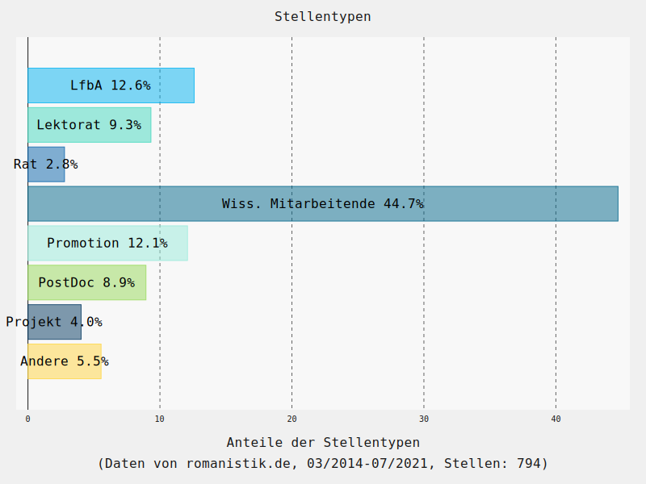
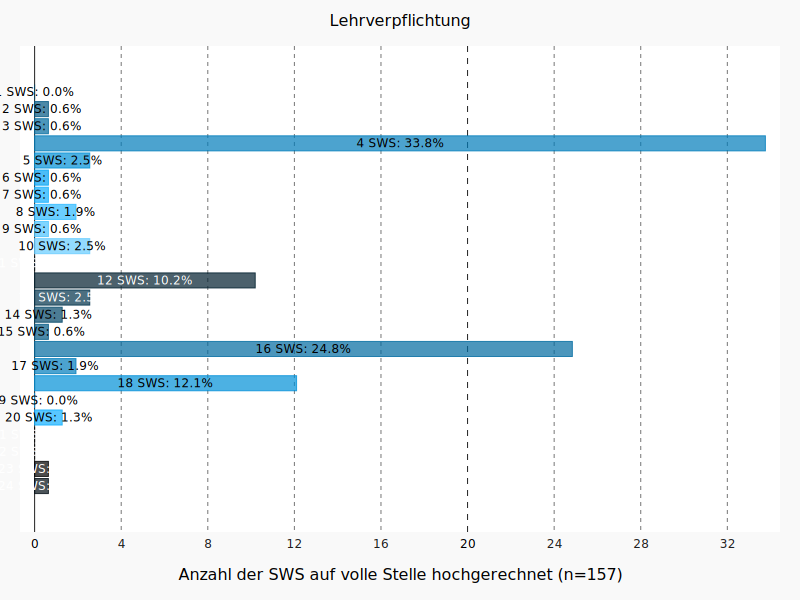
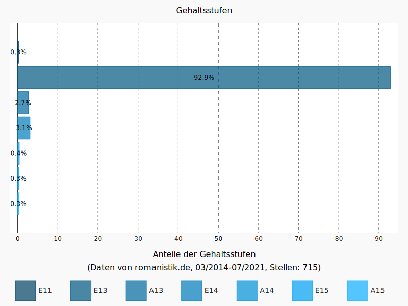
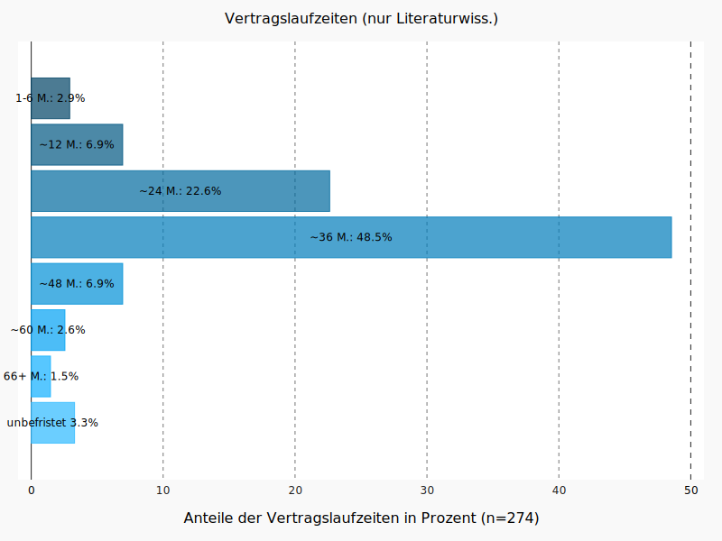
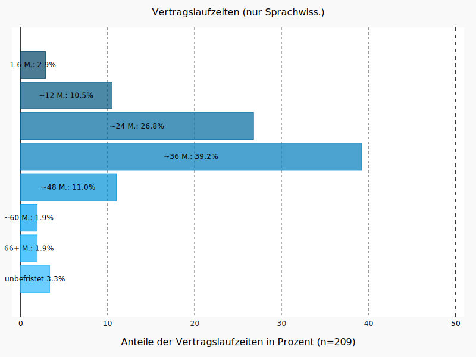
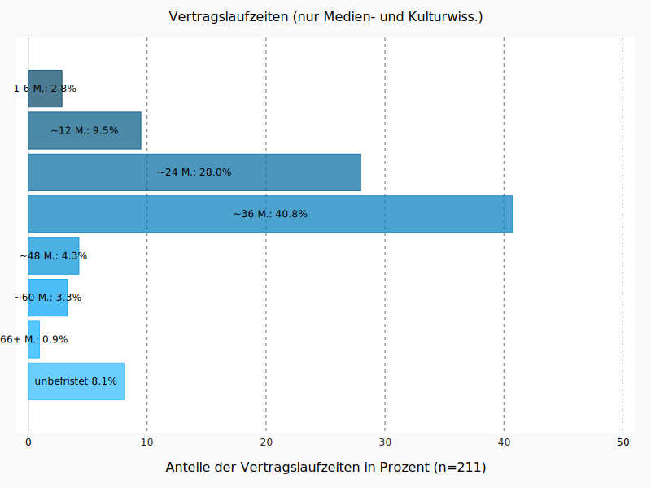
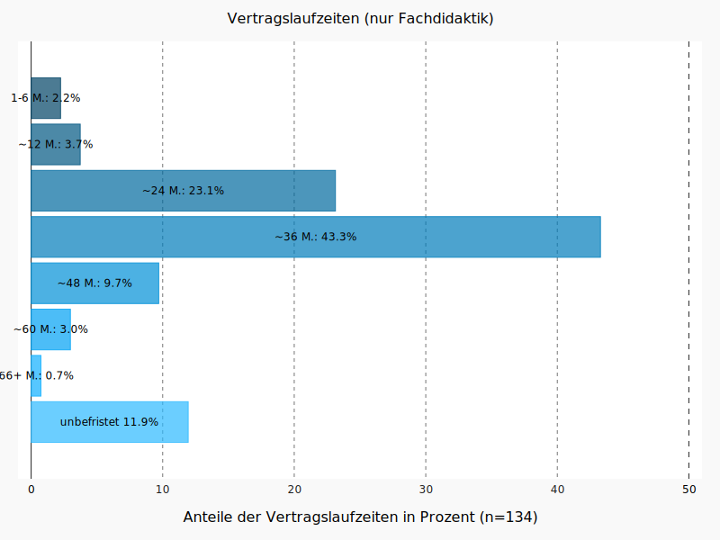
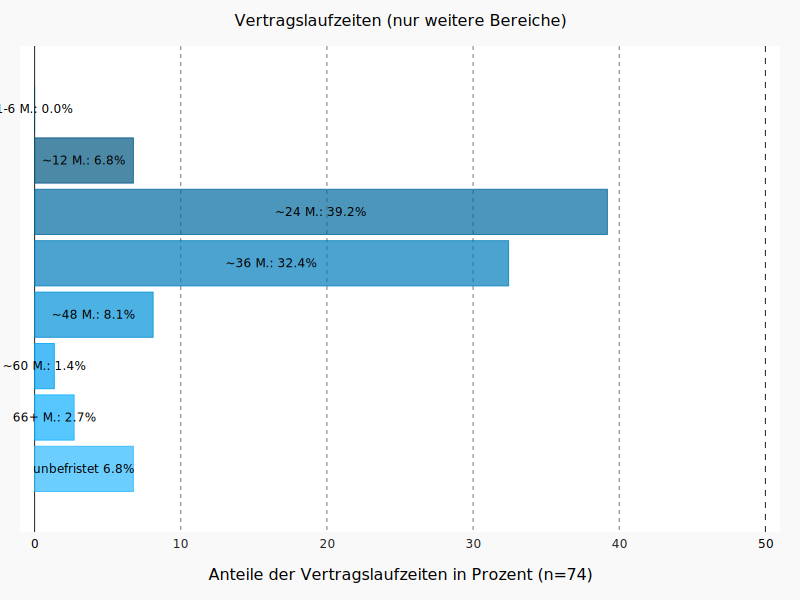

# Zur Stellensituation des Mittelbaus in der deutschen Romanistik: eine Analyse der Ausschreibungen auf romanistik.de in der Zeit von 2014 bis 2021

Im Kontext der Debatten um das Wissenschafts-Zeitvertrags-Gesetz (WissZeitVG), die unter anderem in den sozialen Medien unter dem Hashtag [#IchBinHanna](https://twitter.com/search?q=%23ichbinhannah&src=typed_query&f=live) geführt wurden und werden, erscheint eine Analyse der aktuellen Stellensituation in der deutschen Romanistik von Relevanz. Die vorliegende Darstellung möchte hierzu einen Beitrag leisten. 

## (1) Datengrundlage

Die Datengrundlage der folgenden Analysen sind alle Stellenausschreibungen, die in der Zeit von März 2014 bis Juli 2021 auf der [Plattform romanistik.de im Bereich 'Wissenschaftliche Stellen'](https://romanistik.de/aktuelles/stellen/wissenschaftliche-stellen) publiziert wurden. Ausschreibungen von Professuren, auch von Juniorprofessuren, sind nicht enthalten, ebenso wie Ausschreibungen für nichtwissenschaftliche Stellen (eine Ergänzung der Daten durch diese Stellenkategorien wäre aber denkbar). Alle Daten wurden Ende Juli 2021 erhoben. 

Insgesamt wurden 1107 Stellenanzeigen identifiziert, von denen 794 für die Auswertung berücksichtigt werden konnten. Die übrigen Stellenanzeigen enthielten entweder unvollständige Angaben, oder bezogen sich auf Stellen, die nicht an einer deutschen Einrichtung ausgeschrieben waren, oder waren keine Stellen, die sich spezifisch an romanistisch ausgebildete Bewerber:innen wenden. 

Eine Einschränkung bei der Genauigkeit der Daten ist, dass sich Stellenausschreibungen in bestimmten Fällen, beispielsweise wenn Stellen für Promovierende in Graduiertenkollegs ausgeschrieben werden, nicht nur auf eine, sondern mehrere gleichartige Stellen beziehen. Da solche Ausschreibungen meist nicht ausschließlich romanistische Profile haben, wurden diese Stellen aufgenommen, aber nur einmalig gezählt. 

Die dem derzeitigen Stand zugrunde liegenden Daten wurden am 9. September 2021 aufbereitet. Sie sind im Ordner [data](https://github.com/christofs/romstat/tree/main/data) in diesem Repository verfügbar. Eine weitere Aufbereitung wird u.U. noch genauere Informationen liefern können. 

## (2) Vertragslaufzeiten 

Zunächst ein Blick auf die Laufzeiten der ausgeschriebenen Stellen über den gesamten Untersuchungszeitraum. 

Die Vertragslaufzeiten wurden gruppiert: Das bedeutet, dass beispielsweise die Kategorie "~24" nicht nur Stellen umfasst, die für exakt 24 Monate ausgeschrieben waren, sondern auch solche, die mindestens 18 und weniger als 30 Monate Vertragslaufzeit hatten.

Es wird ersichtlich, dass eine deutliche Mehrheit (63.2%) der Stellenanzeigen eine Vertragslaufzeit von rund 36 Monaten (37.3%) oder rund 24 Monaten (25.5%) vorsehen. Andere Laufzeiten liegen teils knapp, teils deutlich unter 10%. Der Anteil der unbefristet ausgeschrieben Stellen liegt bei 11.1%. 

Dass die Ausschreibungen mit einer Laufzeit von 3 Jahren dominieren, erklärt sich sicherlich in großen Teilen durch entsprechende Laufzeiten bspw. von Doktorand:innenstellen in Graduiertenkollegs oder typischen Projektlaufzeiten bei DFG-geförderten Drittmittelvorhaben. Der hohe Anteil von Ausschreibungen mit einer Laufzeit von nur 2 Jahren erklärt sich daraus jedoch nicht. 

Bei der Einordnung der Zahlen zu den unbefristeten Stellen sollte bedacht werden, dass hier die Anteile der ausgeschrieben Stellen erfasst wurden, nicht der Anteil der aktuell aktiven Wissenschaftler:innen in der Romanistik, die unbefristete Stellen innehaben. 

## (3) Stellentypen 

Bezüglich der Stellentypen ist insbesondere von Interesse, welche Stellentypen außer den klassischen Stellen als Wissenschaftliche/r Mitarbeitende/r in der Romanistik signifikant vertreten sind. 

Wenig überraschend ist, dass der Stellentyp der/des "Wissenschaftlichen Mitarbeiters/in" die Ausschreibungen klar dominiert (über alle Typen der WMA hinweg fast 70%). Aber auch die Lektoratsstellen und die Lehrkräfte für besondere Aufgaben sind signifikant vertreten (gemeinsam rund 20%). Nur kleinere Anteile bestehen für Ratsstellen und Fellowships. (Zu beachten ist, dass die Ausdifferenzierung der verschiedenen Typen von WMA-Stellen im Datensatz noch nicht abgeschlossen ist und sich daher hier noch Verschiebungen ergeben können.) 

## (4) Stellenumfang

Wie verhalten sich die Teilzeit- und Vollzeitstellen zueinander?

Der Stellenumfang der ausgeschrieben Stellen lässt sich in drei Gruppen gliedern: Die größte Gruppe sind Stellen mit der Hälfte der regulären Arbeitszeit (38.9%); ein Drittel der Stellen sind solche mit vollem Stellenumfang (33.5%); die übrigen Stellen machen gemeinsam die kleinste Gruppe aus (vor allem 65%-Stellen, aber gelegentlich auch Stellen mit noch etwas höherem Umfang, zusammengenommen 27.6%). 

## (5) Umfang der Lehrverpflichtung

Wie verhält es sich beim Umfang der Lehrverpflichtung (in SWS)?
 
 

Man beachte, dass der hier angegebene Umfang der SWS für jede Stelle auf das entsprechende Vollzeit-Äquivalent umgerechnet wurde (mit Rundung auf volle SWS). Ist eine 50%-Stelle mit 4 SWS ausgeschrieben, würde sie hier als eine Stelle mit einer normalisierten Lehrverpflichtung von 8 SWS berücksichtigt. Man beachte außerdem, das nur für einen vergleichsweise kleinen Teil der Stellenausschreibungen eine Angabe zur Lehrverpflichtung in den Daten identifiziert werden konnte. 

Das häufigste Lehrverpflichtungs-Äquivalent sind demnach 4 SWS (etwa ein Drittel der Ausschreibungen). Dies wird allerdings dicht gefolgt von 16 SWS (etwa ein Viertel der Ausschreibungen), 18 SWS (immerhin rund 12% der Ausschreibungen) sowie 12 SWS (rund 10% der Ausschreibungen). Andere Lehrverpflichtungen machen nur kleine Anteil der Ausschreibungen aus. In Einzelfällen kommt es aber vor, dass Stellen mit einem Lehrverpflichtungs-Äquivalent von 20 bis 24 SWS ausgeschrieben werden. 

## (6) Eingruppierung

Welche Rolle spielen Eingruppierungen jenseits der Gruppe E13 TV-L?

Wenig überraschend ist, dass die Gehaltsgruppe E13 nach TV-L oder äquivalent die ausgeschriebenen Stellen klar dominiert (92.7%). Nur selten sind Stellen höher, nur ganz vereinzelt niedriger dotiert. Angesichts der Tatsache, dass die Auswertung sich auf wissenschaftliche Stellen fokussiert, waren Einstufungen unter E13 nicht zu erwarten. 

## (7) Vertragslaufzeiten und Stellentypen 

Der Anteil der Ausschreibungen mit unbefristeter Vertragslaufzeit liegt nur bei 11.1% (siehe oben). Es ist daher von Interesse, wie sich die unbefristeten Stellen in die Stellentypen aufgliedern und wie verbreitet unbefristete Ausschreibungen für verschiedene Stellentypen sind. 

### (7.1) Unbefristete Stellentypen

Wie verteilen sich die unbefristeten Stellen über die Stellentypen? 

Es wird deutlich, dass eine knappe Mehrheit (54%) der unbefristet ausgeschrieben Stellen den Kategorien 'Lehrkraft für besondere Aufgaben' (28.7%) oder 'Lektorat' (25.3%) angehören. Beide Stellenkategorien zeichnen sich in der Regel durch hohe Lehrdeputate aus. Auch die Ratsstellen (Studienrat/Studienrätin oder Akademische/r Rat oder Rätin) haben einen signifikanten Anteil (19.5%), ebenso wie die nicht weiter bestimmten Stellen als Wissenschaftliche/r Mitarbeiter/in (17.5%). Die übrigen Stellen betreffen verschiedene Stellenkategorien, beispielsweise Leitungsfunktionen in Sprachenzentren oder Verlagen. 

### (7.2) Vertragslaufzeiten bei Lektoratsstellen

In der umgekehrten Perspektive können die Vertragslaufzeiten auch in Abhängigkeit der Stellentypen aufgeschlüsselt werden. 

Lektoratsstellen werden überwiegend entweder als 2-Jahresstellen oder als unbefristete Stellen ausgeschrieben. 

### (7.3) Vertragslaufzeiten bei LfbA-Stellen

Auch LfbA-Stellen werden überwiegend entweder als 2-Jahresstellen oder als unbefristete Stellen ausgeschrieben. 

### (7.4) Vertragslaufzeiten bei Ratsstellen

Erwartungsgemäß werden Ratsstellen ganz überwiegend unbefristet ausgeschrieben. Sie sind die einzige Stellenkategorie, für die dies gilt. (Man beachte die kleine Gesamtanzahl von Ratsstellen, die die Aussagekraft der exakten Zahlen etwas einschränkt.) 

### (7.5) Vertragslaufzeiten bei WMA-Stellen

Erwartungsgemäß werden WMA-Stellen überwiegend für 2 oder 3 Jahre ausgeschrieben. 

## (8) Vertragslaufzeiten nach Fachgebieten

Mit Blick auf die Ausdifferenzierung der Romanistik nach Fachgebieten stellt sich die Frage, ob es hier signifikante Unterschiede in der Ausschreibungspraxis gibt. 

Die hier unterschiedenen Fachgebiete ergeben sich aus der auf der Plattform romanistik.de genutzten Kategorisierung. Da sich viele Ausschreibungen auf mehr als ein Fachgebiet beziehen, kann hier eine Ausschreibung in mehreren Fachgebieten gezählt werden.  

### (8.1) Vertragslaufzeiten im Vergleich

### (8.2) Vertragslaufzeiten bei Literaturwissenschaft

In der Literaturwissenschaft dominiert die Laufzeit von rund 3 Jahren (48%), mit deutlichem Abstand zur Laufzeit von rund 2 Jahren (22.6). Unbefristet ausgeschrieben wird ein sehr kleiner Anteil der Stellen (3.3%). 

### (8.3) Vertragslaufzeiten bei Sprachwissenschaft

In der Sprachwissenschaft dominiert ebenfalls die Laufzeit von rund 3 Jahren (39.2%), allerdings weniger deutlich als in der Literaturwissenschaft und dichter gefolgt von den Laufzeiten von rund 2 Jahren (26.8%). Unbefristet ausgeschrieben wird ebenfalls ein sehr kleiner Anteil der Stellen (3.3%). 

### (8.4) Vertragslaufzeiten bei Medien- und Kulturwissenschaft

In der Medien- und Kulturwissenschaft dominiert ebenfalls die Laufzeit von rund 3 Jahren (40.8%), ähnlich wie in der Sprachwissenschaft und ebenfalls dichter gefolgt von den Laufzeiten von rund 2 Jahren (28%). Unbefristet ausgeschrieben wird ebenfalls ein etwas größerer Anteil der Stellen als in Sprach- und Literaturwissenschaft (8.1%).

### (8.5) Vertragslaufzeiten bei Fachdidaktik

In der Fachdidaktik dominiert ebenfalls die Laufzeit von rund 3 Jahren (43%), mit etwas Abstand gefolgt von der Laufzeit von rund 2 Jahren (23.1%). Unbefristet ausgeschrieben werden immerhin 11.9% der Stellen. 

### (8.1) Vertragslaufzeiten in den weiteren Bereichen

Die Kategorie "Weitere Bereiche" ist eine Sammelkategorie von romanistik.de. 

In der Kategorie 'Weitere Bereiche' überwiegt, und das gibt es nur hier, die Laufzeit von rund 2 Jahren (39.2%) über die Laufzeit von rund 3 Jahren (32.4%). Unbefristet ausgeschrieben wird hier ein kleiner Anteil der Stellen (6.8%). 

## (9) Vertraglaufzeiten nach Sprachen

Ebenso wie nach Fachgebieten ist auch die Ausdifferenzierung nach Sprachen gegebenenfalls von Interesse. 

### (9.1) Vertragslaufzeit bei Französisch

### (9.2) Vertragslaufzeit bei Spanisch

### (9.3) Vertragslaufzeit bei Italienisch

### (9.4) Vertragslaufzeit bei Portugiesisch

## (10) Entwicklung der Vertragslaufzeiten über die Zeit

Die Darstellung zeigt die Anteile (in Prozent) der verschiedenen Vertragslaufzeiten in jedem der untersuchten Jahre (2014-2021). Die Vertragslaufzeiten wurden auch hier nach dem gleichen Schema wie in der obigen Analyse gruppiert. 

Es zeigt sich, dass die Verhältnisse über die Jahre insgesamt relativ stabil sind, ohne klare Trends zu Anstieg oder Absinken bestimmter Vertragslaufzeiten. 

