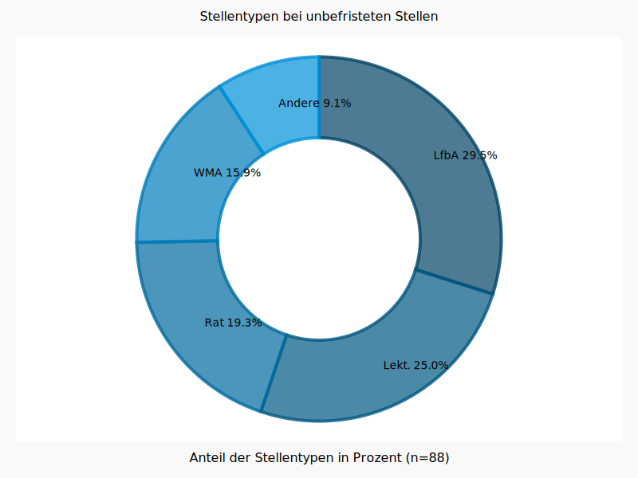

# Einige statistische Beobachtungen zur Stellensituation in der deutschen Romanistik

Im Kontext der Debatten um das Wissenschafts-Zeitvertrags-Gesetz (WissZeitVG), die unter anderem in den sozialen Medien unter dem Hashtag [#IchBinHanna](https://twitter.com/search?q=%23ichbinhannah&src=typed_query&f=live) geführt wurden und werden, erscheint eine Analyse der aktuellen Stellensituation in der deutschen Romanistik von Relevanz. Die vorliegende Darstellung möchte hierzu einen Beitrag leisten. 

## Datengrundlage

Die Datengrundlage der folgenden Analysen sind alle Stellenausschreibungen für wissenschaftliche Mitarbeiter:innen, die in der Zeit von März 2014 bis Juli 2021 auf der Plattform romanistik.de publiziert wurden. Ausschreibungen von Professuren, auch von Juniorprofessuren, sind nicht enthalten, ebenso wie Ausschreibungen für nichtwissenschaftliche Stellen (eine Ergänzung der Daten durch diese Stellenkategorien wäre aber natürlich denkbar). Alle Daten wurden im Juli 2021 erhoben. 

Insgesamt wurden 1107 Stellenanzeigen identifiziert, von denen 799 für die Auswertung berücksichtigt werden konnten, bei einzelnen Analyse auch noch etwas weniger. Die übrigen Stellenanzeigen enthielten entweder unvollständige Angaben, oder bezogen sich auf Stellen, die nicht an einer deutschen Einrichtung ausgeschrieben waren, oder waren nicht im engeren Sinne Stellen, die sich spezifisch an romanistisch ausgebildete Bewerber:innen wenden. 

Eine Einschränkung bei der Genauigkeit der Daten ist, dass sich Stellenausschreibungen in bestimmten Fällen, beispielsweise wenn Stellen für Promovierende in Graduiertenkollegs ausgeschrieben werden, nicht nur auf eine, sondern mehrere gleichartige Stellen beziehen. Da solche Ausschreibungen meist nicht ausschließlich romanistische Profile haben wurden diese Stellen hier nur einmalig gezählt. 

Die dem derzeitigen Stand zugrunde liegenden Daten wurden am 9. September 2021 aufbereitet. Sie sind im Ordner [data](https://github.com/christofs/romstat/tree/main/data) in diesem Repository verfügbar. 

## Stellentypen 

(Eine Auswertung der Stellentypen folgt.)

## Vertragslaufzeiten 

Zunächst ein Blick auf die Laufzeiten der ausgeschriebenen Stellen über den gesamten Untersuchungszeitraum. 

Die Vertragslaufzeiten wurden gruppiert: Das bedeutet, dass beispielsweise die Kategorie "~24" nicht nur Stellen umfasst, die für exakt 24 Monate ausgeschrieben waren, sondern auch solche, die mindestens 18 und weniger als 30 Monate Vertragslaufzeit hatten.

Es wird ersichtlich, dass eine deutliche Mehrheit (63.2%) der Stellenanzeigen eine Vertragslaufzeit von rund 36 Monaten (37.3%) oder rund 24 Monaten (25.5%) vorsehen. Andere Laufzeiten liegen teils knapp, teils deutlich unter 10%. Der Anteil der unbefristet ausgeschrieben Stellen liegt bei 10.8%. 

Dass die Ausschreibungen mit einer Laufzeit von 3 Jahren dominieren, erklärt sich sicherlich in großen Teilen durch entsprechende Laufzeiten bspw. von Doktorand:innenstellen in Graduiertenkollegs oder typischen Projektlaufzeiten bei DFG-geförderten Drittmittelvorhaben. Der hohe Anteil von Ausschreibungen mit einer Laufzeit von nur 2 Jahren erklärt sich daraus jedoch nicht. Bei der Einordnung der Zahlen zu den unbefristeten Stellen sollte bedacht werden, dass hier die Anteile der ausgeschrieben Stellen erfasst wurden, nicht der Anteil der aktuell aktiven Wissenschaftler:innen in der Romanistik, die unbefristete Stellen innehaben. 

## Stellenumfang

Der Stellenumfang der ausgeschrieben Stellen lässt sich in drei Gruppen gliedern: Die größte Gruppe sind Stellen mit der Hälfte der regulären Arbeitszeit (38.9%); ein Drittel der Stellen sind solche mit vollem Stellenumfang (33.5%); die übrigen Stellen machen gemeinsam die kleinste Gruppe aus (vor allem 65%-Stellen, aber gelegentlich auch 75%-Stellen, zusammengenommen 27.6%). 

## Lehrverpflichtung

(Eine Analyse zum Umfang der Lehrverpflichtung folgt noch.) 

## Eingruppierung

Wenig überraschend ist, dass die Gehaltsgruppe E13 die ausgeschriebenen Stellen klar dominiert (92.7%). Nur selten sind Stellen höher, nur ganz vereinzelt niedriger dotiert. Angesichts der Tatsache, dass die Auswertung sich auf wissenschaftliche Stellen fokussiert, waren Einstufungen unter E13 nicht zu erwarten. 

## Unbefristete Stellentypen

Für den Anteil der unbefristet ausgeschrieben Stellen (siehe oben) ist von Interesse, welchen Stellenkategorien diese angehören. 

Es wird deutlich, dass eine knappe Mehrheit (54%) der unbefristet ausgeschrieben Stellen den Kategorien 'Lehrkraft für besondere Aufgaben' (28.7%) oder 'Lektorat' (25.3%) angehören. Beide Stellenkategorien zeichnen sich in der Regel durch hohe Lehrdeputate aus. Auch die Ratsstellen (Studienrat/Studienrätin oder Akademische/r Rat oder Rätin) haben einen signifikanten Anteil (19.5%), ebenso wie die nicht weiter bestimmten Stellen als Wissenschaftliche/r Mitarbeiter/in (17.5%). Die übrigen Stellen betreffen verschiedene Stellenkategorien, beispielsweise Leitungsfunktionen in Sprachenzentren oder Verlagen.   

## Vertragslaufzeiten pro Jahr

Die Darstellung zeigt die Anteile (in Prozent) der verschiedenen Vertragslaufzeiten in jedem der untersuchten Jahre (2014-2021). Die Vertragslaufzeiten wurden auch hier nach dem gleichen Schema wie in der obigen Analyse gruppiert. Es zeigt sich, dass die Verhältnisse über die Jahre insgesamt relativ stabil sind, ohne klare Trends zu Anstieg oder Absinken bestimmter Vertragslaufzeiten. 

